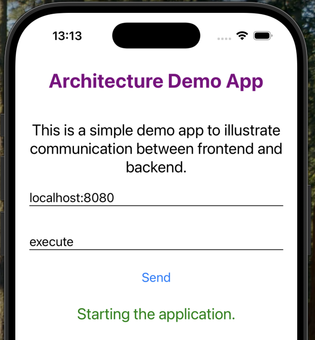

# Mini Demo - Frontend / Backend Architecture

## Objective

The demo app is a simple mobile application built with React Native that allows users to send commands to a backend server. The backend, implemented with FastAPI and running in a Docker container, receives these commands via HTTP requests and responds with a message based on the command received (but not actually doing anything else). Allowed commands are __log__ and __execute__. For example, the user can enter a command in the app, send it to the backend, and immediately see the backend’s response displayed (the green text in the screenshot) in the app. This setup demonstrates how a mobile frontend and a Python backend can communicate over a network, providing a clear example of frontend-backend interaction in a modern application architecture.



You can enter the host and port in the second input field to allow the app to connect to different backend servers. This is useful for testing or development, as you might want to run the backend on your local machine, a different computer, or even a remote server. Especially when you use the expo go app you need to set the correct IP address (see below the QR code). 
By making the host and port configurable, you don’t have to change the code each time—you can simply enter the address of the backend you want to connect to and the app will send its requests there. 

## Architecture Overview

Below is a simple diagram showing how the different parts of your demo application interact:

```
+---------------------+           HTTP POST/GET           +----------------------+
|                     |  <---------------------------->   |                      |
|  React Native App   |                                   |   FastAPI Backend    |
|  (Expo, mobile)     |                                   |   (Uvicorn, Docker)  |
|                     |                                   |                      |
+---------------------+                                   +----------------------+
                                                          |
                                                          |
                                    docker build/run only for backend
                                                          |
                                                          v
                                                [Docker Container]
```

- The **React Native App** (frontend) communicates with the **FastAPI Backend** (backend) using HTTP requests.
- The backend is containerized and managed using Docker (`docker build` and `docker run`), but Docker is **not** used for the frontend. This makes sense as the app later runs on a mobile phone (or for now in the expo go app).
- This separation allows you to develop, test, and deploy each part independently.

```
+-------------------------------------------------------------+
|                        Host Machine                         |
|                                                             |
|   docker run -p 8080:8000 hm-command-app                    |
|                                                             |
|   +-----------------------------------------------+         |
|   |           Docker Container (hm-command-app)   |         |
|   |                                               |         |
|   |   +-------------------------------+           |         |
|   |   |         Uvicorn Server        |           |         |
|   |   |   (listens on 0.0.0.0:8000)   |           |         |
|   |   |      +-------------------+    |           |         |
|   |   |      |  FastAPI Backend  |    |           |         |
|   |   |      |   (main.py/app)   |    |           |         |
|   |   |      +-------------------+    |           |         |
|   |   +-------------------------------+           |         |
|   +-----------------------------------------------+         |
|                                                             |
+-------------------------------------------------------------+

Port Mapping: 8080 (host) ---> 8000 (container)
```
## 1. Environment setup

### 1.1 Install Poetry

Poetry is a modern tool for dependency management and packaging in Python. It allows you to declare the libraries your project depends on and it will manage (install/update) them for you.

https://python-poetry.org/docs/

### 1.2 Folder structure for the demo project

```
├── backend-api     //the folder for the FastAPI backend
├── mobile-app      //the folder for the react native app
└── sbs-guide.md    //this guide ;-)
```

## 2. The Backend API

### 2.1 Initialize the backend project

Switch to the backend-api folder and initialize the poetry project. Follow the wizard.

```bash
cd backend-api
poetry init
```

This will create a pyproject.toml which is the central configuration file for your project.  

```
├── backend-api
│   └── pyproject.toml
├── mobile-app
└── sbs-guide.md
```

E.g. you can set the python version here.

**backend-api/pyproject.toml**
```toml
[tool.poetry]
name = "backend-api"
version = "0.1.0"
description = ""
authors = ["SCS"]
readme = "README.md"
packages = [{include = "backend_api"}]

[tool.poetry.dependencies]
python = "^3.11"

[build-system]
requires = ["poetry-core"]
build-backend = "poetry.core.masonry.api"
```

### 2.2 Add dependencies

You can add needed libraries with the __poetry add__ command.

- **FastAPI**  
  FastAPI is a modern Python web framework for building APIs quickly and efficiently. It lets you define endpoints (URLs) and how your backend should respond to requests. FastAPI is known for being fast, easy to use, and for automatically generating interactive API documentation (Swagger UI).

- **"uvicorn[standard]"**  
  Uvicorn is a lightweight web server that runs your FastAPI application and handles incoming web requests. The `[standard]` part installs some extra recommended dependencies (for more features).  
  In short:  
  - **FastAPI** is your web application code (the logic and endpoints).
  - **Uvicorn** is the server that actually runs your FastAPI app and makes it accessible over the network.

```shell
poetry add fastapi
poetry add "uvicorn[standard]"
```
After executing these commands you can see the dependencies in the toml.

```toml
[tool.poetry]
name = "backend-api"
version = "0.1.0"
description = ""
authors = ["SCS"]
readme = "README.md"
packages = [{include = "backend_api"}]

[tool.poetry.dependencies]
python = "^3.11"
fastapi = "^0.115.12"
uvicorn = {extras = ["standard"], version = "^0.34.2"}

[build-system]
requires = ["poetry-core"]
build-backend = "poetry.core.masonry.api"
```

Optional: Activate the virtual environment

```shell
poetry shell
```

### 2.3 Add a .gitignore

See an example for Python, Poetry, FastAPI here: [.gitignore](backend-api/.gitignore)

### 2.4 Create a FastAPI app

The code of our demo backend application is in one single file (main.py). In more complex projects you would have more files structured in subfolders.

You can create a FastAPI app in one single line:

```python
app = FastAPI()
```

### 2.4 Add a GET request

The following endpoint implements a simple health check for the backend API.  
It responds to GET requests at `/healthcheck` and accepts an optional query parameter `test`.  
The endpoint returns a JSON message confirming receipt of the parameter.

```python
@app.get("/healthcheck", tags=["System"])
def is_healthy(test: str = Query("test", description="Enter any string as test parameter")):
    return {"message": f"Successfully extracted URL param from GET request: {test}."}
```

- **Route:** `/healthcheck`
- **Method:** GET
- **Query Parameter:**  
  - `test` (string, optional): Any string value. Defaults to `"test"`.
  - Example URL: /healthcheck?test=xyz
- **Response:**  
  - JSON object with a message containing the value of the `test` parameter.

- `@app.get("/healthcheck", tags=["System"])`:  
  - Registers this function as a handler for GET requests to `/healthcheck`.
  - The `tags` parameter is used for grouping endpoints in the API docs.
- `test: str = Query("test", description="...")`:  
  - This tells FastAPI to expect a query parameter called `test` (with a default value and description).
  - FastAPI uses Python type hints (like `str`) for automatic validation and documentation.

### 2.5 Add a POST request

The following endpoint allows the client to send a command to the backend API via a POST request to `/run`.  
It expects a JSON body with a `command` field. Depending on the value of `command`, the backend will perform different actions and return a corresponding message.

```python
# Pydantic model for POST body
class CommandRequest(BaseModel):
    command: str
```

A Pydantic model is a special Python class used in FastAPI (and other frameworks) to define and validate the structure of data, such as the data you expect in a request body.

```python
@app.post("/run", tags=["Application"])
def run_command(request: CommandRequest):
    command = request.command
    if command == "log":
        print("Logging to terminal...")
        return {"message": "Printing to terminal."}
    elif command == "execute":
        return {"message": "Starting the application."}
    else:
        return {"message": f"Unknown command: {command}!"}
```

- **Route:** `/run`
- **Method:** POST
- **Request Body:**  
  - JSON object with a `command` field (string).  
    Example: `{ "command": "log" }`
- **Behavior:**  
  - If `command` is `"log"`, logs a message to the terminal and returns a confirmation.
  - If `command` is `"execute"`, returns a message indicating the application is starting.
  - For any other value, returns a message indicating the command is unknown.
- **Response:**  
  - JSON object with a `message` field describing the result.

- `@app.post("/run", tags=["Application"])`:  
  - Registers this function as a handler for POST requests to `/run`.
  - The `tags` parameter is used for grouping endpoints in the automatically generated API docs (Swagger UI).
- `request: CommandRequest`:  
  - FastAPI uses the Pydantic model `CommandRequest` to automatically parse and validate the incoming JSON request body.
  - This ensures that the `command` field is present and of the correct type, and it provides clear documentation in Swagger.

### 2.5 Run the server

To start your FastAPI backend, use the following command:

```shell
uvicorn main:app --reload --port 8080
```

- `uvicorn` is a lightweight web server that can be used to run FastAPI applications.
- `main:app` tells Uvicorn to look for the `app` object inside the `main.py` file.
- `--reload` enables auto-reloading, so the server restarts automatically when you make code changes (useful for development).
- `--port 8080` runs the server on port 8080 (so you can access it at `http://localhost:8080`).

After running this command, your API will be live, and you can visit [`http://localhost:8080/docs`](http://localhost:8080/docs) to interact with the automatically generated Swagger UI.

## 3. Create a simple React Native App

### 3.1 Create expo app from template

```shell
npx create-expo-app@latest --template
```
For this example use the blank typescript template.

### 3.2 Create the app

Be aware that imports and styles are not displayed in the following code snippet.

```tsx
export default function App() {
  const [command, setCommand] = useState<string>('');
  const [message, setMessage] = useState<string>('');
  const [host, setHost] = useState<string>('localhost:8080');

  const sendCommand = async () => {
      try {
        const response = await fetch(`http://${host}/run`, {
        method: 'POST',
        headers: {
          'Content-Type': 'application/json',
        },
        body: JSON.stringify({ command }),
      });
        const data = await response.json();
        setMessage(data.message);
      } catch (error) {
        console.error(error);
        setMessage('Failed to execute command.');
      }
  };

  return (
    <View style={styles.container}>
      <Text style={styles.title}>Architecture Demo App</Text>
      <Text style={styles.paragraph}>
        This is a simple demo app to illustrate communication between frontend 
        and backend.</Text>
      <TextInput
        style={styles.input}
        placeholder="Enter a host and port"
        value={host}
        onChangeText={setHost}
        autoCapitalize='none'
      />
      <TextInput
        style={styles.input}
        placeholder="Enter a command"
        value={command}
        onChangeText={setCommand}
        autoCapitalize='none'
      />
      <Button title="Send" onPress={sendCommand} />
      <Text style={styles.message}>{message}</Text>
    </View>
  );
}
```

**Step-by-step breakdown:**

1. **Function Declaration:**  
   The function is declared as `async` so you can use `await` for asynchronous operations like network requests.

2. **Sending the Request:**  
   - `fetch` is used to send an HTTP request to the backend.
   - The URL is constructed using the `host` state variable and the `/run` endpoint.
   - The `method` is set to `'POST'`, indicating you want to send data to the server.
   - The `headers` specify that the request body is JSON.
   - The `body` is a JSON string containing the `command` entered by the user.

3. **Handling the Response:**  
   - `await response.json()` parses the JSON response from the backend.
   - `setMessage(data.message)` updates the UI with the message returned by the backend (e.g., confirmation or error).

4. **Error Handling:**  
   - If any error occurs (e.g., network issues, server errors), it is caught by the `catch` block.
   - The error is logged to the console, and a user-friendly error message is displayed in the app.

**Why is this important?**
- This method demonstrates how to connect your frontend (React Native) to your backend (FastAPI) using HTTP requests.
- It shows how to handle asynchronous operations, parse JSON, and update the UI based on server responses.
- Proper error handling ensures your app provides feedback even when something goes wrong.

**Tip:**  
You can extend this method to handle more complex interactions, such as sending additional data, handling different response types, or updating other parts of your UI based on the backend’s response.

## 4. Containerize the backend API

### 4.1 Write a docker file

```dockerfile
FROM python:3.11

WORKDIR /app

RUN pip install --no-cache-dir poetry

COPY main.py pyproject.toml poetry.lock* ./
RUN poetry install --no-root --no-interaction

EXPOSE 8000

CMD ["poetry", "run", "uvicorn", "main:app", "--host", "0.0.0.0", "--port", "8000"]
```

### Explanation of the Dockerfile step-by-step

```dockerfile
FROM python:3.11
```
- **FROM python:3.11**  
  This sets the base image for your container. It uses the official Python 3.11 image from Docker Hub, which includes Python and common dependencies.

```dockerfile
WORKDIR /app
```
- **WORKDIR /app**  
  Sets the working directory inside the container to `/app`. All subsequent commands will be run from this directory, and files will be copied here.

```dockerfile
RUN pip install --no-cache-dir poetry
```
- **RUN pip install --no-cache-dir poetry**  
  Installs [Poetry](https://python-poetry.org/), a tool for dependency management and packaging in Python.  
  The `--no-cache-dir` option reduces image size by not caching installation files.

```dockerfile
COPY main.py pyproject.toml poetry.lock* ./
```
- **COPY main.py pyproject.toml poetry.lock* ./**  
  Copies your application code (`main.py`) and Poetry configuration files (`pyproject.toml` and optionally `poetry.lock`) from your project directory on your machine into the `/app` directory in the container.

```dockerfile
RUN poetry install --no-root --no-interaction
```
- **RUN poetry install --no-root --no-interaction**  
  Installs all dependencies specified in `pyproject.toml` using Poetry.  
  - `--no-root` skips installing the project itself as a package (useful for simple scripts).
  - `--no-interaction` disables prompts, making the install process fully automated.

```dockerfile
EXPOSE 8000
```
- **EXPOSE 8000**  
  Informs Docker that the container will listen on port 8000 at runtime. This is the port where Uvicorn (your FastAPI server) will run.

```dockerfile
CMD ["poetry", "run", "uvicorn", "main:app", "--host", "0.0.0.0", "--port", "8000"]
```
- **CMD [...]**  
  Specifies the default command to run when the container starts:  
  - `poetry run uvicorn main:app` starts the FastAPI app using Uvicorn.
  - `--host 0.0.0.0` makes the server accessible from outside the container.
  - `--port 8000` runs the server on port 8000 inside the container.

---

**Summary:**  
This Dockerfile creates a lightweight, reproducible environment for your FastAPI backend. It ensures all dependencies are installed, exposes the correct port, and starts your API server automatically when the container runs.

### 4.2 Build the docker image

```shell
docker build -t hm-command-app .
```

- **`docker build`** is the command that tells Docker to create a new image based on the instructions in your `Dockerfile`.
- **`-t hm-command-app`** assigns a name (or "tag") to your image, making it easier to reference later. Here, the image will be called `hm-command-app`.
- **`.`** (the dot) specifies the build context, which is the directory Docker will use to find the `Dockerfile` and all files needed for the build. Usually, you run this command from the root of your backend project.

**What happens during this step?**
- Docker reads your `Dockerfile` line by line and executes each instruction, creating a new image layer for each step.
- It installs Python, Poetry, your dependencies, and sets up your FastAPI app so it’s ready to run in a container.

---

### 4.3 Run the container

```shell
docker run -p 8080:8000 hm-command-app
```

- **`docker run`** starts a new container from the image you just built.
- **`-p 8080:8000`** maps port 8000 inside the container (where your FastAPI app is running) to port 8080 on your computer. This means you can access your API at `http://localhost:8080`.
- **`hm-command-app`** is the name of the image to run.

**What happens during this step?**
- Docker creates a running instance (container) of your image.
- The container starts up, runs the command specified in the `CMD` of your Dockerfile (which launches your FastAPI app with Uvicorn), and listens for requests.
- You can now interact with your API from your browser, Postman, or your React Native app, just as if it were running locally.

---

## How to Start Your Own Project: Step-by-Step Recommendations

If you’re new to software engineering, it can be hard to know where to begin. Here’s a recommended approach, based on the architecture from this demo:

### 1. **Start with the Backend**

Why?  
It’s easier to build and test your data and logic first, then connect your frontend later.

**Steps:**
- **a. Set up your backend folder** (e.g., `backend-api/`).
- **b. Initialize a Python project** using Poetry or `venv`.
- **c. Create a simple FastAPI app** with a health check endpoint (like `/healthcheck`).
- **d. Test your backend locally** using Swagger UI (`/docs`) to make sure it works.
- **e. Add more endpoints as needed** (e.g., a `/run` command endpoint).
- **f. (Optional) Containerize your backend** with Docker once it works.

### 2. **Then Build the Frontend**

Why?  
Once your backend is running, you can connect your app to real data and see results.

**Steps:**
- **a. Set up your frontend folder** (e.g., `mobile-app/`).
- **b. Create a new React Native app** using Expo.
- **c. Build a simple screen** that can send a request to your backend’s health check endpoint.
- **d. Add more UI features** as you add more backend endpoints.

### 3. **Connect Frontend and Backend**

- Make sure your frontend can reach your backend (check network settings and ports).
- Test sending requests from your app to your backend and displaying the results.

### 4. **Iterate and Improve**

- Add features one at a time, testing both backend and frontend as you go.
- Commit your work regularly and keep your documentation updated.

---

**Summary:**  
> **Start with the backend, then build the frontend, and connect them step by step.**  
This approach helps you avoid confusion and makes debugging much easier. Don’t try to build everything at once—get one part working, then move to the next!

**Tip:**  
If you ever feel stuck, go back to a simple working version and build up again from there. And don’t hesitate to ask for help!